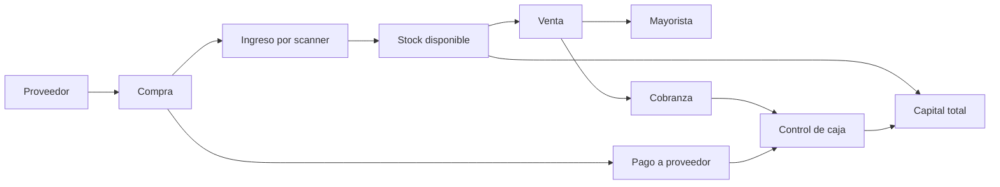
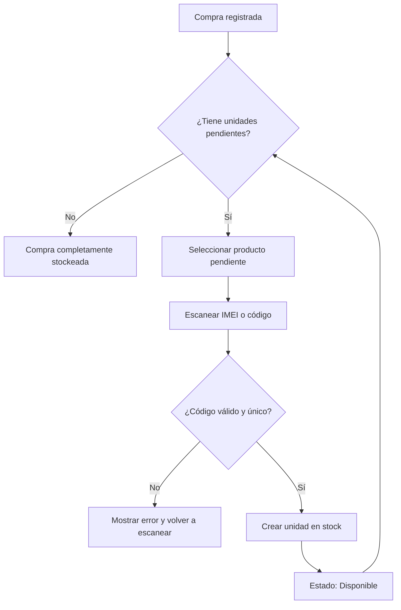
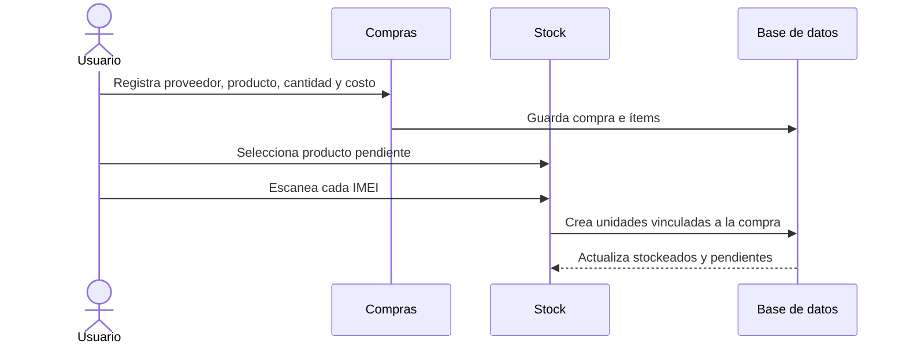
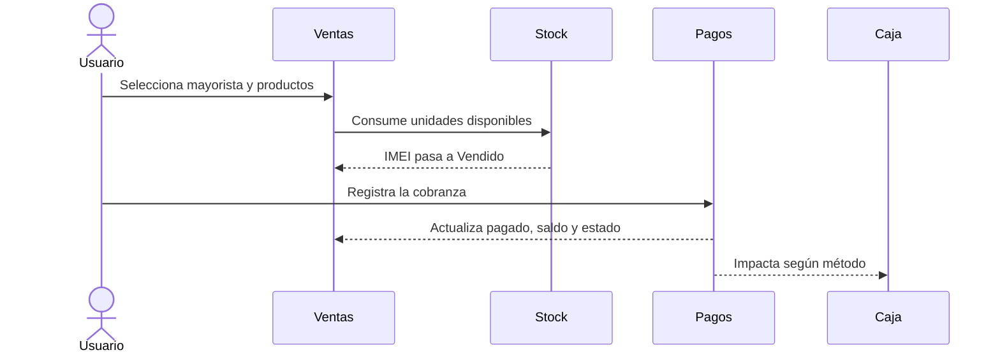
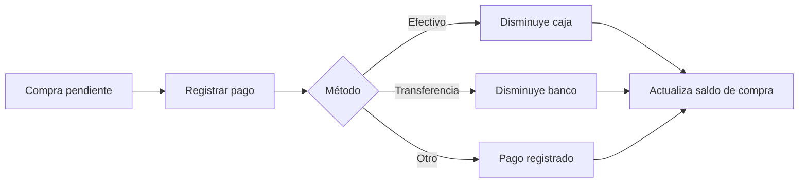

# Manual de uso y flujos de trabajo

> Guía operativa del ERP para administrar el circuito completo de compras, inventario, ventas, cobranzas y caja.

## Mapa general



El orden de trabajo recomendado es:

1. Crear proveedores y mayoristas.
2. Registrar la compra.
3. Ingresar físicamente cada unidad al stock.
4. Registrar la venta.
5. Registrar cobros y pagos.
6. Controlar la caja diaria.
7. Realizar el cierre mensual.

---

## Índice

1. [Inicio de sesión](#1-inicio-de-sesión)
2. [Dashboard](#2-dashboard)
3. [Proveedores](#3-proveedores)
4. [Compras](#4-compras)
5. [Ingreso al stock](#5-ingreso-al-stock)
6. [Detalle de stock](#6-detalle-de-stock)
7. [Mayoristas](#7-mayoristas)
8. [Ventas](#8-ventas)
9. [Pagos y cobranzas](#9-pagos-y-cobranzas)
10. [Control de caja](#10-control-de-caja)
11. [Capital total](#11-capital-total)
12. [Flujos completos](#12-flujos-completos)
13. [Cierre diario y mensual](#13-cierre-diario-y-mensual)
14. [Buenas prácticas](#14-buenas-prácticas)
15. [Problemas frecuentes](#15-problemas-frecuentes)

---

## 1. Inicio de sesión

1. Abrir la aplicación.
2. Ingresar usuario y contraseña.
3. Presionar **Ingresar**.
4. Al finalizar el trabajo, utilizar **Cerrar sesión** desde el menú lateral.

La sesión se mantiene activa mediante un token de acceso. Todas las operaciones posteriores requieren una sesión válida.

---

## 2. Dashboard

El Dashboard concentra el estado general del negocio para el mes seleccionado.

### Información disponible

| Indicador | Qué representa |
|---|---|
| Total vendido | Importe de las ventas del período |
| Total comprado | Importe de las compras del período |
| Ganancia estimada | Diferencia entre ventas y compras |
| Saldo pendiente | Ventas todavía no cobradas |
| Efectivo | Movimientos registrados como efectivo |
| Banco | Movimientos registrados como transferencia |
| Cuenta corriente | Créditos y deudas pendientes |
| Stock | Mercadería valorizada al costo |
| Capital total | Suma de los componentes patrimoniales |

### Uso recomendado

1. Seleccionar mes y año.
2. Revisar ventas y compras.
3. Controlar saldos pendientes.
4. Revisar mayoristas demorados.
5. Comparar capital inicial y capital actual.

> [!IMPORTANT]
> ARS, USD y CHL se presentan por separado. No deben sumarse directamente sin una conversión definida.

---

## 3. Proveedores

Los proveedores representan a las personas o empresas a quienes se compra mercadería.

### Crear un proveedor

1. Entrar en **Proveedores**.
2. Presionar **Nuevo proveedor**.
3. Completar nombre, teléfono, email y notas.
4. Elegir el estado.
5. Presionar **Guardar proveedor**.

### Estados

| Estado | Uso |
|---|---|
| Activo | Puede seleccionarse en operaciones nuevas |
| Inactivo | Conserva el historial, pero no debe utilizarse en operaciones nuevas |

---

## 4. Compras

Una compra registra la mercadería adquirida. Registrar una compra **no significa** que todas sus unidades ya hayan ingresado físicamente al inventario.

### Registrar una compra

1. Entrar en **Compras**.
2. Presionar **Nueva compra**.
3. Seleccionar el proveedor.
4. Ingresar el producto.
5. Indicar cantidad y costo unitario.
6. Seleccionar fecha y moneda.
7. Indicar el pago inicial, si existe.
8. Agregar notas.
9. Presionar **Guardar compra**.

### Resultado

```text
Total compra = Cantidad × Costo unitario
Saldo = Total compra − Importe pagado
Pendiente de stock = Cantidad comprada − Unidades ingresadas
```

### Estados de pago

| Estado | Condición |
|---|---|
| Pendiente | No se pagó el total |
| Parcial | Se pagó una parte |
| Pagada | El saldo es cero |

### Detalle de compra

Desde el listado, presionar **Ver detalle** para consultar:

- Proveedor y fecha.
- Total, pagado y saldo.
- Productos y costos.
- Cantidad comprada, stockeada y pendiente.
- IMEI ingresados.
- Historial de pagos.
- Notas.

---

## 5. Ingreso al stock

Cada unidad física debe registrarse mediante su IMEI o código y quedar asociada al ítem de compra correspondiente.



### Ingreso con cámara

1. Entrar en **Stock**.
2. Seleccionar el producto pendiente.
3. Presionar **Abrir cámara**.
4. Autorizar el acceso.
5. Apuntar al código.
6. Esperar la confirmación automática.

El sistema completa desde la compra:

- Producto.
- Proveedor.
- Costo y moneda.
- Compra de origen.
- Fecha de ingreso.
- Estado **Disponible**.

### Pistola lectora o ingreso manual

1. Seleccionar el producto pendiente.
2. Leer o escribir el código en el campo.
3. Presionar `Enter`.

### Validaciones

- No permite IMEI duplicados.
- No permite códigos de barras duplicados.
- No permite stockear más unidades que las compradas.
- Exige una compra/producto pendiente.

> [!NOTE]
> La cámara requiere HTTPS o `localhost`, permiso de cámara y un navegador actualizado, preferentemente Chrome o Edge.

---

## 6. Detalle de stock

Desde **Stock**, presionar **Ver detalle**.

### Filtros

- Proveedor de origen.
- Producto.
- Estado.
- IMEI o código de barras.

### Trazabilidad por unidad

| Dato | Descripción |
|---|---|
| Producto | Modelo o producto asociado |
| IMEI / código | Identificador único |
| Proveedor | Origen de la mercadería |
| Compra | Operación que incorporó la unidad |
| Ingreso | Fecha de alta en inventario |
| Costo | Valor y moneda de compra |
| Estado | Disponible, reservado, vendido o inactivo |
| Destino | Venta y mayorista, cuando corresponda |

La trazabilidad completa es:

```text
Proveedor → Compra → Producto/IMEI → Stock → Venta → Mayorista
```

---

## 7. Mayoristas

Los mayoristas representan a los clientes.

### Alta y edición

1. Entrar en **Mayoristas**.
2. Presionar **Nuevo mayorista** o el ícono de edición.
3. Completar nombre, contacto, notas y estado.
4. Guardar.

### Detalle del mayorista

Desde **Ver detalle** se puede consultar:

- Datos de contacto.
- Equipos vendidos.
- Ventas históricas.
- Total, pagado y saldo.
- Estado de cada venta.
- Historial de pagos.
- Totales separados por moneda.
- Filtro mensual.

---

## 8. Ventas

Una venta toma unidades disponibles, las relaciona con un mayorista y cambia su estado a **Vendido**.

### Registrar una venta

1. Entrar en **Ventas**.
2. Presionar **Nueva venta**.
3. Seleccionar el mayorista.
4. Elegir los productos disponibles.
5. Indicar cantidades y precios unitarios.
6. Seleccionar fecha y vencimiento.
7. Ingresar el pago inicial, si corresponde.
8. Seleccionar moneda y agregar notas.
9. Presionar **Generar venta**.

### Efecto en el inventario


No se puede vender una unidad reservada, vendida o inactiva.

### Total mensual

El card superior de Ventas permite seleccionar un mes y consultar:

- Total vendido en ARS.
- Total vendido en USD.
- Total vendido en CHL.
- Cantidad de ventas.

### Detalle de venta

- Mayorista, fecha y estado.
- Total, pagado y saldo.
- Productos, cantidades y precios.
- IMEI vendidos.
- Pagos aplicados.
- Notas.

---

## 9. Pagos y cobranzas

La sección **Pagos** registra entradas y salidas de dinero vinculadas a ventas o compras.

### Cobrar una venta

1. Seleccionar tipo **Venta**.
2. Elegir mayorista y venta.
3. Ingresar monto, fecha y moneda.
4. Seleccionar método.
5. Agregar observaciones.
6. Presionar **Registrar pago**.

### Pagar una compra

1. Seleccionar tipo **Compra**.
2. Elegir proveedor y compra.
3. Ingresar monto, fecha y moneda.
4. Seleccionar método.
5. Registrar el pago.

### Impacto del método

| Método | Impacto principal |
|---|---|
| Efectivo | Control de caja y componente Efectivo |
| Transferencia | Componente Banco |
| Tarjeta | Registrado como pago, fuera del efectivo estricto |
| Otro | Registrado como pago, fuera del efectivo estricto |

Al registrar un pago se actualizan automáticamente el importe pagado, el saldo y el estado de la operación.

---

## 10. Control de caja

La sección **Caja** contiene dos análisis independientes:

1. Control diario exclusivamente en efectivo.
2. Composición del capital total.

### Arqueo diario

1. Entrar en **Caja**.
2. Seleccionar el día.
3. Presionar **Actualizar**.
4. Comparar el sistema con el efectivo físico.

```text
Capital inicial en efectivo
+ Cobros de ventas en efectivo
− Pagos de compras en efectivo
= Capital al cierre del día
```

La vista muestra:

- Capital inicial del mes.
- Ingresos del día.
- Egresos del día.
- Capital al cierre del día.
- Ventas cobradas en efectivo.
- Compras pagadas en efectivo.

> [!IMPORTANT]
> Transferencias, tarjetas y otros métodos no se incluyen en el arqueo diario de efectivo.

---

## 11. Capital total

El capital total complementa el control de caja; no lo reemplaza.

| Componente | Cálculo conceptual |
|---|---|
| Efectivo | Cobros en efectivo − pagos en efectivo |
| Banco | Transferencias recibidas − transferencias realizadas |
| Cuenta corriente | Ventas pendientes − compras pendientes |
| Stock | Costo de las unidades que permanecen en inventario |
| Capital total | Efectivo + Banco + Cuenta corriente + Stock |

El capital inicial de cada mes debe coincidir con el capital final del mes anterior:

```text
Capital inicial de julio = Capital final de junio
```

El cálculo se reconstruye desde la base de datos para la fecha seleccionada y se presenta por moneda.

---

## 12. Flujos completos

### 12.1 Compra hasta disponibilidad



### 12.2 Venta hasta cobranza



### 12.3 Pago a proveedor



---

## 13. Cierre diario y mensual

### Checklist diario

- [ ] Registrar todas las compras del día.
- [ ] Ingresar al stock las unidades recibidas.
- [ ] Registrar todas las ventas.
- [ ] Registrar cobros y pagos con el método correcto.
- [ ] Comparar la caja del sistema con el efectivo físico.
- [ ] Revisar diferencias desde los enlaces de cada operación.
- [ ] Confirmar saldos pendientes.

### Checklist mensual

- [ ] Revisar el total mensual de ventas.
- [ ] Revisar compras y pagos a proveedores.
- [ ] Controlar mayoristas con deuda.
- [ ] Validar efectivo y banco.
- [ ] Revisar cuenta corriente.
- [ ] Verificar stock físico contra stock del sistema.
- [ ] Confirmar el capital final por moneda.
- [ ] Utilizar el cierre como capital inicial del mes siguiente.

---

## 14. Buenas prácticas

- Registrar cobros y pagos siempre desde **Pagos**.
- Seleccionar correctamente el método y la moneda.
- Registrar la compra antes de stockear.
- Stockear antes de vender.
- No reutilizar IMEI.
- No modificar manualmente un IMEI vendido sin revisar su venta.
- No mezclar monedas en los análisis.
- Utilizar notas para documentar excepciones.
- Inactivar registros en lugar de perder su historial.
- Controlar la caja diariamente.

---

## 15. Problemas frecuentes

### La cámara no abre

- Verificar permisos.
- Utilizar HTTPS o `localhost`.
- Cerrar otras aplicaciones que usen la cámara.
- Probar con Chrome o Edge actualizado.

### El código no se detecta

- Mejorar la iluminación.
- Ajustar la distancia.
- Limpiar la cámara.
- Ingresar el código manualmente y presionar `Enter`.

### No aparece un producto para stockear

- Confirmar que exista una compra.
- Confirmar que tenga unidades pendientes.
- Revisar que no se haya stockeado la cantidad completa.

### No aparece un producto para vender

- Confirmar que fue ingresado al stock.
- Verificar que su estado sea **Disponible**.
- Revisar que no esté reservado, vendido o inactivo.

### Un pago no aparece en Caja

El arqueo diario solo considera pagos con método **Efectivo**. Las transferencias impactan en **Banco** dentro del capital total.

### El saldo o capital no coincide

Revisar:

- Operación asociada.
- Fecha.
- Monto y moneda.
- Método de pago.
- Pago inicial.
- Movimientos anteriores al inicio del mes.
- Productos ingresados o vendidos fuera de fecha.

---

## Regla operativa principal

> Cada movimiento debe registrarse una sola vez, en la operación correcta, con su fecha, moneda y método reales. La calidad del Dashboard, la Caja y el Capital depende de esa trazabilidad.
